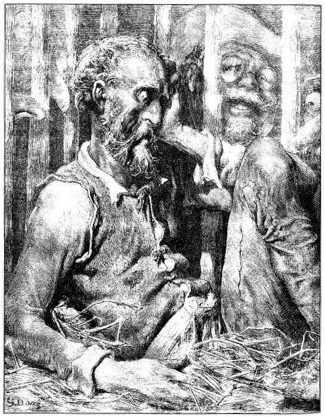

<section>

</section>

[^1]: Miguel de Cervantes Saavedra se narodil roku 1547 chudým rodičům v Alcalá de Henares ve Španělsku. Není jisté, studoval-li na univerzitě. Jeho prvním literárním dílem je Elegie na smrt ženy Filipa II. r. 1569, provázená několika jinými kratšími básněmi. Po dvanáct následujících let vede C. život velmi pohnutý: V prosinci 1568 odchází do Itálie v službách legáta Giulia Acquavivy, r. 1570 vstupuje do vojska Marca Antonia Colonny; účastní se války proti Turkům, bojuje u Navarina, Korfu, Tunisu a La Goulette; r. 1571 v námořní bitvě u Lepanta ztrácí levou ruku. Loď, která jej r. 1575 odváží z Neapole do vlasti, je zajata piráty a C. odvlečen jako otrok do Alžíru, kde pobude pět let. Je vykoupen křesťany až v září 1580. Od r. 1582 se věnuje především literatuře. Z jeho děl stojí za zmínku časově první román „Galatea“, nedokončený román pastýřský, obšírná, jednotvárná a konvenční to napodobenina pastorál italských, na níž si však velmi zakládal (farář v „Donu Quijotu“ ji chválí a touží po jejím dokončení). Z jeho četných dramat se zachovala pouze dvě: „El trato de Argel“ (Alžírský obchod), kde se objevuje i autor v osobě otroka Savedra, a „Numancia“, vlastenecká hra bez jednoty kompozice a oplývající zosobněnými abstrakcemi, jež si nevysloužila Goethův obdiv. R. 1588 se C. vrací do veřejného života: Je komisařem pro dodávky Nepřemožitelné armádě a o něco později výběrčím daní v Granadě. R. 1597 je zatčen a uvězněn na tři měsíce pro nepořádky v úřadě. Když je r. 1603 je vyslán do Valladolidu, aby se zde zodpovídal ze svého přečinu, přiváží s sebou už rukopis první části „Dona Quijota“; snad jej počal ve vězení, jak by se dalo vyvozovat z některých výrazů v předmluvě. První díl „Dona Quijota“ vychází v Madridu r. 1605, jeho úspěch je veliký, doma i za hranicemi: za několik let vznikne řada cizích překladů (francouzský je z r. 1608). Zdá se, že „Don Quijote“ zůstane nedokončen jako „Galetea“. Po osm let C. mlčí, teprve r. 1613 vydává knihu zdařilých pitoreskních novel „Novelas ejemplares“ (Vzorné povídky), r. 1614 pak nepodařenou báseň „Viaje del Parnaso“ (Cesta na P.), r. 1615 „Ocho comedias“ (Osm komedií). Ale r. 1614 vychází v Tarragoně jako pokračování k prvnímu dílu jeho „Dona Quijota“ kniha, podepsaná pseudonymem Alfonso Fernández de Avellaneda (pravděpodobně byl jejím autorem Aragonec Alfonso Lamberto). C. rozhněván, dokončí rychle druhý díl svého románu a vydá jej r. 1615 (v předmluvě polemizuje s Avellanedou). Své další literární plány C. neuskutečnil. Posmrtně vyšel ještě dobrodružný román „Persiles y Sigismonda“. C. zemřel 23. dubna 1616.
